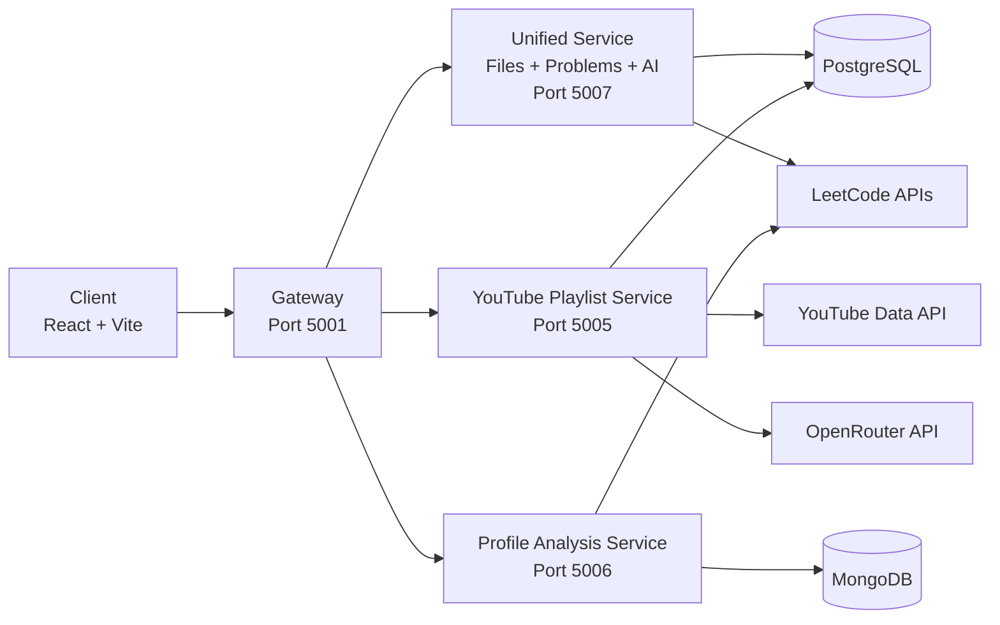
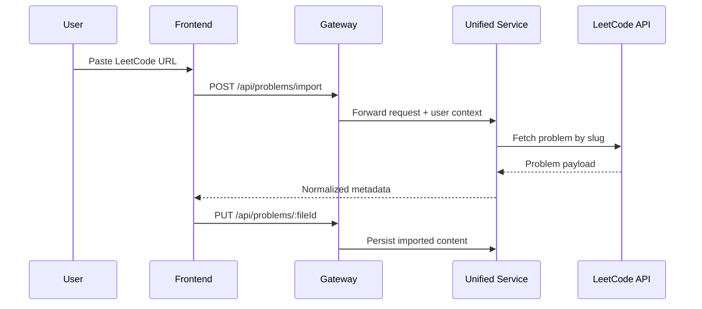
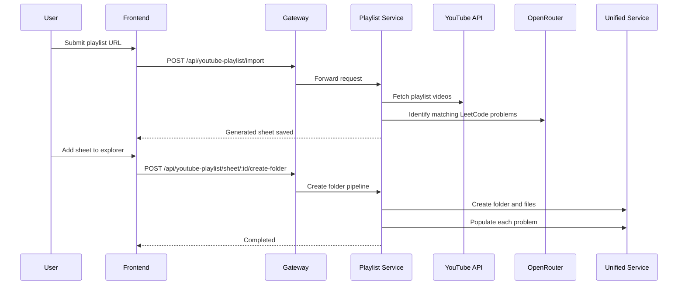
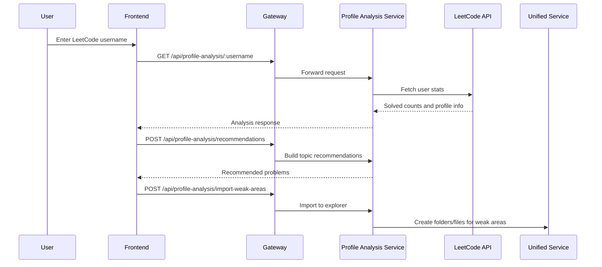

# AlgoNote AI

<div align="center">

### Build your DSA prep like a product, not a pile of tabs.

Personal interview preparation workspace with structured problem solving, playlist-to-sheet generation, profile-guided recommendations, and revision-first workflows.


</div>

---

## Why this project exists

Most interview prep feels fragmented: coding in one place, notes in another, playlists in another, and revision tracking in random docs.

AlgoNote AI combines everything into one product workflow:

1. Collect problems from LeetCode, GFG, pasted lists, and YouTube playlists.
2. Organize them in an IDE-style explorer.
3. Solve with brute, better, and optimal approaches.
4. Save notes, complexity, source metadata, and revision state.
5. Build targeted revision folders from weak areas.

---

## Core product features

## 1) Workspace-style DSA explorer
- Nested folder and file hierarchy like a coding IDE.
- Fast add, rename, delete, and status toggles.
- Folder views with search and revision controls.

## 2) Rich problem editor
- Dedicated problem page with metadata, notes, and coding tabs.
- Separate fields for brute, better, and optimal solutions.
- Complexity analysis fields and AI-assisted complexity endpoint.

## 3) LeetCode and GFG imports
- Import LeetCode problem content from URL.
- Import GFG problem content from URL.
- Persist problem source, tags, snippets, and descriptions.

## 4) YouTube playlist to revision sheet
- Parse playlist videos via YouTube API.
- Match videos to LeetCode problems with OpenRouter model inference.
- Save generated sheet with confidence score and metadata.
- One-click add generated sheet into workspace folders/files.

## 5) Profile analysis and recommendation engine
- Fetch LeetCode profile stats by username.
- Build recommendations by weak topics.
- Import weak area recommendations directly to explorer structure.
- Store user revision history in MongoDB.

## 6) Revision list parser
- Paste raw text list from LeetCode/GFG/mixed sources.
- Parse into structured problem objects.
- Create workspace folders from parsed revision lists.

## 7) Authentication and user-scoped requests
- Clerk-protected frontend and gateway.
- Gateway forwards user context to downstream services.
- Development fallback mode supported when explicitly enabled.

---

## Product architecture



---

## Service map

| Service | Port | Responsibility |
|---|---:|---|
| Gateway | 5001 | Auth, request proxying, upstream routing |
| Unified Service | 5007 | File tree, problem CRUD, LeetCode/GFG/list import, AI analyze |
| YouTube Playlist Service | 5005 | Playlist ingestion, AI matching, sheet CRUD, create folder from sheet |
| Profile Analysis Service | 5006 | LeetCode stats, recommendations, revision tracking, weak-area import |
| Client | 80 (container) | Product UI |

---

## Routing overview

```mermaid
flowchart TD
    A[/api/files] --> G[Gateway]
    B[/api/problems] --> G
    C[/api/ai] --> G
    D[/api/youtube-playlist] --> G
    E[/api/profile-analysis] --> G

    G --> U[Unified Service]
    G --> Y[YouTube Playlist Service]
    G --> P[Profile Analysis Service]
```

---

## End-to-end feature flows

### LeetCode import flow



### YouTube playlist to workspace flow



### Profile analysis and weak-area import



---

## Frontend experience

Main app routes:

- /sign-in and /sign-up for authentication
- / for dashboard
- /folder/:id for folder details
- /problem/:id for problem workspace
- /playlist for playlist sheets
- /leetcode-list for revision list import
- /profile-analysis for profile-based recommendations

UI patterns:

- Lazy-loaded route pages for performance.
- Sidebar navigation with explorer tree behavior.
- Optimistic updates in store for faster interaction.
- Clerk-aware protected layout for product routes.

---

## Data model highlights

## Unified Service (PostgreSQL)
- File node entity for folder/file tree.
- Problem detail entity linked to fileId.
- Stores notes, metadata, solutions, complexity fields, and source context.

## YouTube Playlist Service (PostgreSQL)
- LearningSheet entity for imported playlists.
- SheetProblem entity for per-video mapped problem rows.

## Profile Analysis Service (MongoDB)
- Revision entries per user for tracking and review.

---

## API surface (high level)

### Unified Service via gateway
- GET /api/files
- POST /api/files
- PUT /api/files/:id
- DELETE /api/files/:id
- GET /api/problems/:fileId
- POST /api/problems
- PUT /api/problems/:fileId
- DELETE /api/problems/:fileId
- POST /api/problems/import
- POST /api/problems/gfg
- POST /api/problems/leetcode-list
- POST /api/problems/leetcode-list/create-folder
- POST /api/ai/analyze

### YouTube Playlist Service via gateway
- POST /api/youtube-playlist/import
- GET /api/youtube-playlist/sheets
- GET /api/youtube-playlist/sheet/:id
- PATCH /api/youtube-playlist/sheet/:id
- PUT /api/youtube-playlist/sheet/:id
- DELETE /api/youtube-playlist/sheet/:id
- POST /api/youtube-playlist/sheet/:id/create-folder

### Profile Analysis Service via gateway
- GET /api/profile-analysis/:username
- POST /api/profile-analysis/recommendations
- POST /api/profile-analysis/topic-questions
- POST /api/profile-analysis/import-weak-areas
- POST /api/profile-analysis/revision
- GET /api/profile-analysis/revision/:username
- DELETE /api/profile-analysis/revision/:id

---

## Tech stack

### Frontend
- React 19
- Vite
- React Router
- Zustand
- Tailwind CSS
- Clerk
- Monaco Editor
- Framer Motion
- Axios

### Backend
- Node.js
- Express
- http-proxy-middleware
- Sequelize with PostgreSQL
- Mongoose with MongoDB
- Axios

### External integrations
- LeetCode APIs
- YouTube Data API v3
- OpenRouter

### Deployment
- Docker
- Docker Compose
- Nginx

---

## Repository structure

```text
.
|- client/
|  |- src/
|  |  |- components/
|  |  |- pages/
|  |  |- services/
|  |  `- store/
|- backend/
|  |- gateway/
|  `- services/
|     |- unified-service/
|     |- youtube-playlist-service/
|     `- profile-analysis-service/
|- docker-compose.yml
|- nginx.conf
|- start-backend.ps1
`- README.md
```

---

## Local development

## 1) Install dependencies

```bash
npm install
npm install --prefix client
npm install --prefix backend
npm install --prefix backend/gateway
npm install --prefix backend/services/unified-service
npm install --prefix backend/services/youtube-playlist-service
npm install --prefix backend/services/profile-analysis-service
```

## 2) Configure environment

Create root .env with required values.

Minimum required:

- DATABASE_URL
- MONGO_URI
- YOUTUBE_API_KEY
- OPENROUTER_API_KEY or OPENAI_API_KEY
- CLERK_SECRET_KEY
- CLERK_PUBLISHABLE_KEY
- VITE_CLERK_PUBLISHABLE_KEY

Optional but useful:

- UNIFIED_SERVICE_URL
- PLAYLIST_SERVICE_URL
- PROFILE_SERVICE_URL
- ENABLE_DEV_AUTH_FALLBACK=true (local development only)

## 3) Run backend

Option A:

```bash
npm run start:backend
```

Option B on Windows:

```powershell
./start-backend.ps1
```

## 4) Run frontend

```bash
npm run dev --prefix client
```

---

## Docker deployment

## Build and run

```bash
docker compose up --build -d
```

## Check status

```bash
docker compose ps
docker compose logs -f gateway
```

## Update existing deployment

```bash
docker compose pull
docker compose up -d --remove-orphans
```

---

## Production readiness checklist

- Set all production environment variables.
- Use real Clerk keys and enforce auth in gateway.
- Restrict CORS and harden allowed origins.
- Add HTTPS termination with reverse proxy/load balancer.
- Enable observability: logs, health checks, uptime alerts.
- Run database backups and restore drills.
- Add rate limiting at gateway layer.
- Validate API key quotas for YouTube and OpenRouter.
- Add CI pipeline for lint, build, and smoke tests.

---

## Known startup pitfalls

- Missing Clerk keys can stop authenticated flows.
- Neon/PostgreSQL cold starts can delay service boot.
- Playlist import may be slower for long playlists.
- Port conflicts on 5001, 5005, 5006, or 5007 will break startup.

---

## Vision

AlgoNote AI is designed as a long-term interview prep operating system:

- structured capture,
- deliberate practice,
- revision discipline,
- and data-backed improvement,

all in one place.

---

## Author note

This is not a demo-only side tool. It is a product foundation built to be shipped live, iterated continuously, and improved through real usage.