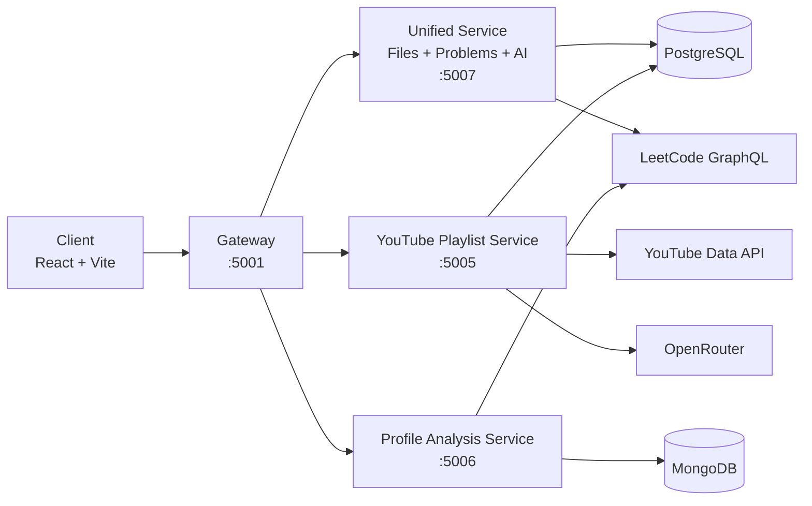
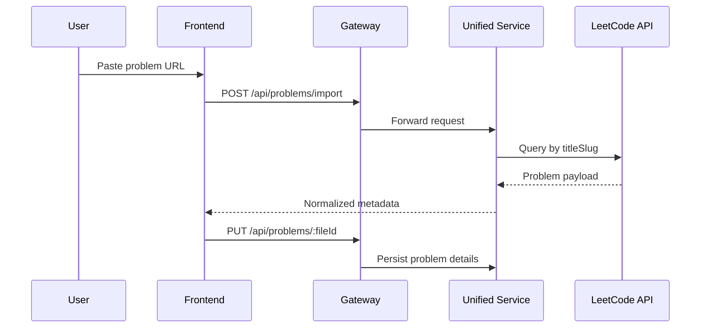
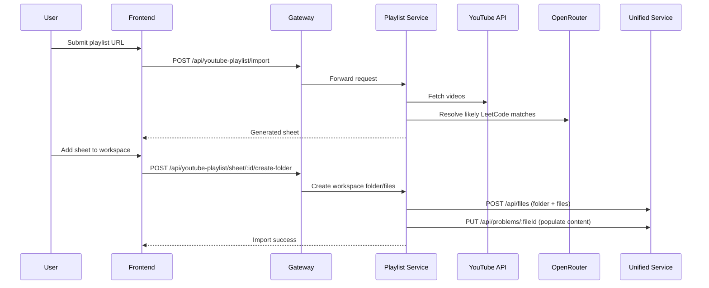
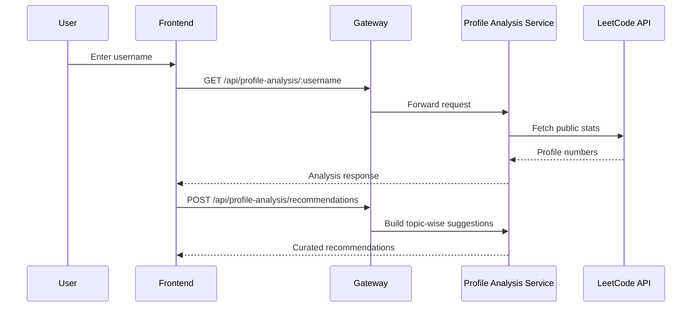

# AlgoNote AI

AlgoNote AI is a full-stack DSA revision platform that combines problem solving, note taking, playlist-to-sheet generation, and profile-guided practice inside one workspace.

## Highlights

- IDE-style workspace for DSA files and folders
- Rich per-problem editor for brute/better/optimal approaches
- One-click LeetCode import (metadata + statement + starter snippets)
- YouTube playlist to revision sheet pipeline
- Profile analysis with weak-area recommendations
- Auth-aware, user-scoped API usage via gateway

## Why This Project

Interview prep tools are usually fragmented: browser tabs, notes apps, random docs, and spreadsheets.

AlgoNote AI unifies the loop:

1. Discover questions
2. Organize and solve
3. Store notes and complexity analysis
4. Generate targeted revision tasks

## Main Features

### Problem Workspace

- Monaco-based coding editor
- Multi-solution layout: brute, better, optimal
- Notes, tags, difficulty, and complexity fields
- Save and revisit every problem state

### Explorer-Like File System

- Folder/file hierarchy like an IDE sidebar
- Topic-wise and sheet-wise structuring
- Rename, delete, and revision-state controls

### LeetCode Import

- Input a LeetCode URL
- Auto-fetches title, slug, difficulty, description, tags, and starter code
- Persists imported content directly into your problem record

### YouTube Playlist to Sheet

- Import playlist videos
- Match videos to LeetCode problems using deterministic + AI-assisted mapping
- Store generated sheet in database
- Add full sheet to workspace as files in one action

### Profile Analysis

- Fetch LeetCode public profile stats
- Generate recommendations by weak area
- Import weak-area questions into workspace structure

### Auth and Request Context

- Clerk on frontend and gateway
- Gateway forwards authenticated user context to downstream services
- Data operations are scoped through API context

## Architecture



## Request Routing Overview

```mermaid
flowchart TD
    A[/api/files] --> G[Gateway]
    B[/api/problems] --> G
    C[/api/ai] --> G
    D[/api/youtube-playlist] --> G
    E[/api/profile-analysis] --> G

    G --> U[Unified Service]
    G --> Y[YouTube Playlist Service]
    G --> P[Profile Analysis Service]

    U --> U1[files routes]
    U --> U2[problem routes]
    U --> U3[ai routes]
```

## Core Flows

### 1) LeetCode URL Import



### 2) Playlist Import and Add to Workspace



### 3) Profile Analysis to Recommendations



## Tech Stack

### Frontend

- React 19 + Vite
- React Router
- Zustand
- Tailwind CSS
- Monaco Editor
- Framer Motion
- Axios
- Clerk

### Backend

- Node.js + Express
- API Gateway with proxy middleware
- Unified service for files, problems, and AI endpoints
- Playlist service for YouTube ingestion and matching
- Profile analysis service for stats and recommendations
- Sequelize (PostgreSQL) + Mongoose (MongoDB)

### External Integrations

- LeetCode GraphQL
- YouTube Data API v3
- OpenRouter

## Repository Structure

```text
.
|- client/
|  |- src/
|  |  |- components/
|  |  |- pages/
|  |  |- services/
|  |  `- store/
|- backend/
|  |- gateway/
|  `- services/
|     |- unified-service/
|     |- youtube-playlist-service/
|     `- profile-analysis-service/
|- docker-compose.yml
|- start-backend.ps1
`- README.md
```

## Local Development

### 1) Install dependencies

```bash
npm install
npm install --prefix client
npm install --prefix backend
npm install --prefix backend/gateway
npm install --prefix backend/services/unified-service
npm install --prefix backend/services/youtube-playlist-service
npm install --prefix backend/services/profile-analysis-service
```

### 2) Configure environment

```bash
cp .env.example .env
```

Fill required variables in root `.env`:

- `DATABASE_URL`
- `OPENAI_API_KEY` (or OpenRouter-compatible key)
- `YOUTUBE_API_KEY`
- `MONGO_URI`
- `CLERK_SECRET_KEY`
- `VITE_CLERK_PUBLISHABLE_KEY`

### 3) Run backend services

From repo root:

```bash
npm run start:backend
```

### 4) Run frontend

```bash
npm run dev --prefix client
```

## Docker Deployment

Build and start all services:

```bash
docker compose up --build -d
```

Update stack after changes:

```bash
docker compose pull
docker compose up -d --remove-orphans
```

Included containers:

- client
- gateway
- unified-service
- youtube-playlist-service
- profile-analysis-service
- mongodb

## EC2 Quick Deploy

### 1) Provision

- Ubuntu 22.04 LTS
- 30 GB+ disk
- Open ports: 22, 80, 443 (if TLS enabled)

### 2) Install runtime tools

```bash
sudo apt-get update
sudo apt-get install -y docker.io docker-compose-plugin git
sudo usermod -aG docker $USER
```

Reconnect SSH once after adding Docker group.

### 3) Clone and configure

```bash
sudo mkdir -p /opt/algonote
sudo chown -R $USER:$USER /opt/algonote
cd /opt/algonote
git clone <your-repo-url> .
```

Create root `.env` with production values.

### 4) Start

```bash
docker compose pull
docker compose up -d --remove-orphans
```

### 5) Verify

```bash
docker compose ps
docker compose logs -f gateway
```

## API Surface (High Level)

- `GET /api/files`
- `POST /api/files`
- `PUT /api/files/:id`
- `DELETE /api/files/:id`
- `GET /api/problems/:fileId`
- `PUT /api/problems/:fileId`
- `POST /api/problems/import`
- `POST /api/ai/analyze`
- `POST /api/youtube-playlist/import`
- `GET /api/youtube-playlist/sheets`
- `GET /api/youtube-playlist/sheet/:id`
- `POST /api/youtube-playlist/sheet/:id/create-folder`
- `GET /api/profile-analysis/:username`
- `POST /api/profile-analysis/recommendations`
- `POST /api/profile-analysis/import-weak-areas`

## Troubleshooting

- Backend exits with `EADDRINUSE`: a service port is already occupied. Free the port or change service port env values.
- Playlist import succeeds but add-to-workspace fails: verify `UNIFIED_SERVICE_URL`, `FILE_SERVICE_URL`, and `PROBLEM_SERVICE_URL` are reachable from playlist service runtime.
- Missing auth behavior: ensure `CLERK_SECRET_KEY` and `VITE_CLERK_PUBLISHABLE_KEY` are correctly set.

## Vision

AlgoNote AI is moving toward an interview-prep operating system where discovery, solving, revision, and feedback loops live in one place with minimal context switching.
